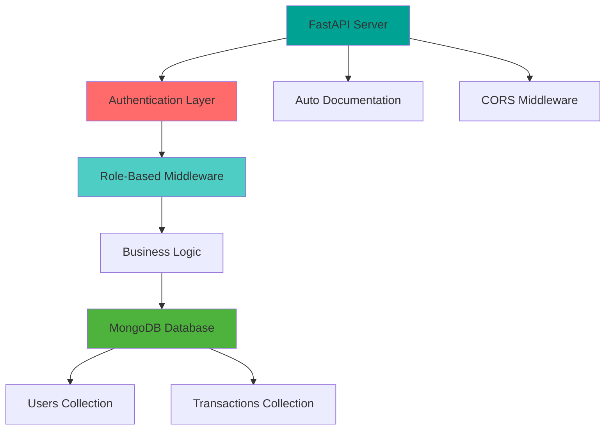
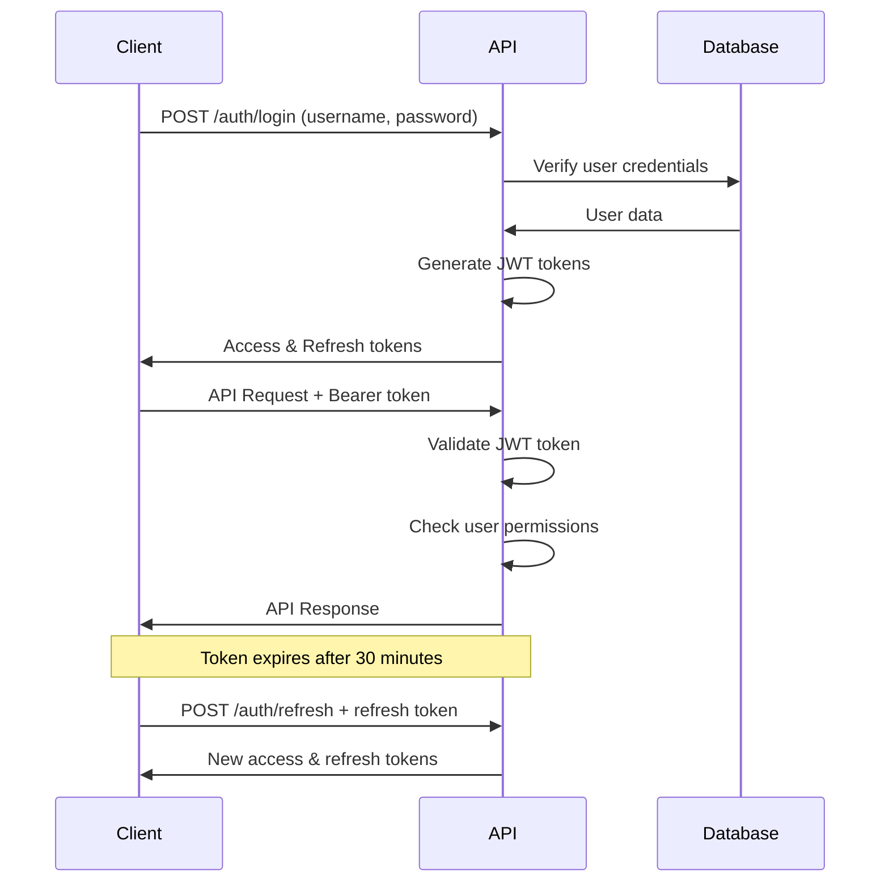

# 💰 Financial Management System

<div align="center">


**A modern, secure, and scalable financial management REST API built with FastAPI and MongoDB**

[📖 API Documentation](#-api-documentation) •
[🚀 Quick Start](#-quick-start) •
[🔧 Installation](#-installation) •
[🏗️ Architecture](#️-architecture) •
[🔒 Security](#-security)

---

</div>

## 🎯 **Overview**

The Financial Management System is a comprehensive REST API designed for organizations to manage their financial transactions with robust role-based access control. Built with modern Python technologies, it provides secure authentication, transaction management, and detailed financial reporting.

### ✨ **Key Features**

| Feature | Description | Status |
|---------|-------------|--------|
| 🔐 **JWT Authentication** | Secure login with access/refresh tokens | ✅ |
| 👥 **Role-Based Access** | Admin, Accountant, User permissions | ✅ |
| 💰 **Transaction Management** | Deposits, expenses, CRUD operations | ✅ |
| 📊 **Financial Reports** | Summary reports, user analytics | ✅ |
| 🔒 **Password Security** | Bcrypt hashing with salt rounds | ✅ |
| 📱 **REST API** | Clean JSON responses for frontend integration | ✅ |
| 🐳 **Docker Ready** | Containerized deployment with Docker Compose | ✅ |
| ⚡ **Async Operations** | High-performance async/await throughout | ✅ |
| 📝 **Auto Documentation** | Interactive Swagger/OpenAPI docs | ✅ |
| 🗄️ **MongoDB Integration** | Modern NoSQL database with Motor driver | ✅ |

---

## 🏗️ **Architecture**

### **Technology Stack**



### **Project Structure**

```
financial-backend/
├── 📁 app/                          # Main application package
│   ├── 📄 __init__.py
│   ├── 🚀 main.py                   # FastAPI application entry point
│   ├── 📁 api/                      # API route handlers
│   │   ├── 🔐 auth.py              # Authentication endpoints
│   │   ├── 👥 users.py             # User management (Admin)
│   │   ├── 💰 transactions.py      # Transaction operations
│   │   └── 📊 reports.py           # Financial reporting
│   ├── 📁 core/                     # Core functionality
│   │   ├── ⚙️ config.py            # Application settings
│   │   ├── 🔒 security.py          # JWT & password utilities
│   │   └── 🛡️ auth.py              # Authentication dependencies
│   ├── 📁 crud/                     # Database operations
│   │   ├── 👤 user.py              # User database operations
│   │   └── 💳 transaction.py       # Transaction database operations
│   ├── 📁 db/                       # Database configuration
│   │   └── 🗄️ mongodb.py           # MongoDB connection & setup
│   └── 📁 models/                   # Pydantic data models
│       ├── 👤 user.py              # User schemas
│       └── 💳 transaction.py       # Transaction schemas
├── 📄 requirements.txt              # Python dependencies
├── 🐳 Dockerfile                   # Container configuration
├── 📄 docker-compose.yml           # Multi-service setup
├── 📄 .env.example                 # Environment variables template
└── 📖 README.md                    # This file
```

---

## 🚀 **Quick Start**

### **Option 1: Docker Compose (Recommended)**

```bash
# Clone the repository
git clone <repository-url>
cd financial-backend

# Start all services
docker-compose up --build

# API available at: http://localhost:8000
# Docs available at: http://localhost:8000/docs
```

### **Option 2: Local Development**

```bash
# Create virtual environment
python -m venv venv
source venv/bin/activate  # On Windows: venv\Scripts\activate

# Install dependencies
pip install -r requirements.txt

# Setup environment
cp .env.example .env
# Edit .env with your MongoDB URL and JWT secret

# Start MongoDB (if not using Docker)
# Option A: Local MongoDB
mongod --dbpath /your/db/path

# Option B: MongoDB Docker
docker run -d -p 27017:27017 --name mongodb mongo:7.0

# Run the application
uvicorn app.main:app --reload --host 0.0.0.0 --port 8000
```

---

## 🔧 **Installation**

### **Prerequisites**

| Requirement | Version | Notes |
|-------------|---------|--------|
| 🐍 **Python** | 3.11+ | Async/await support required |
| 🗄️ **MongoDB** | 4.4+ | NoSQL database |
| 🐳 **Docker** | 20.10+ | Optional, for containerization |
| 📦 **pip** | Latest | Python package manager |

### **Dependencies**

```bash
# Core Framework
fastapi==0.104.1              # Modern web framework
uvicorn[standard]==0.24.0     # ASGI server

# Database
motor==3.3.2                  # Async MongoDB driver
pymongo==4.6.0               # MongoDB driver

# Authentication & Security
python-jose[cryptography]==3.3.0  # JWT handling
passlib[bcrypt]==1.7.4            # Password hashing

# Data Validation
pydantic==2.5.0               # Data validation
pydantic-settings==2.1.0      # Settings management
email-validator==2.1.0        # Email validation

# Utilities
python-multipart==0.0.6       # File upload support
```

### **Environment Configuration**

Create a `.env` file in the project root:

```bash
# Database Configuration
MONGODB_URL=mongodb://localhost:27017
DATABASE_NAME=financial_management

# JWT Configuration (Change these in production!)
SECRET_KEY=your-super-secret-jwt-key-change-this-in-production-please
ALGORITHM=HS256
ACCESS_TOKEN_EXPIRE_MINUTES=30
REFRESH_TOKEN_EXPIRE_DAYS=7

# CORS Configuration
CORS_ORIGINS=["http://localhost:3000","http://127.0.0.1:3000","http://localhost:8080"]

# Application Settings
ENVIRONMENT=development
```

---

## 📊 **Database Schema**

### **Users Collection**

```javascript
{
  _id: ObjectId("..."),
  name: "John Doe",
  username: "johndoe",           // Unique login identifier
  email: "john@example.com",     // Unique email address
  password_hash: "$2b$12$...",   // Bcrypt hashed password
  role: "user",                  // admin | accountant | user
  created_at: ISODate("...")
}

// Indexes
db.users.createIndex({ "email": 1 }, { unique: true })
db.users.createIndex({ "username": 1 }, { unique: true })
```

### **Transactions Collection**

```javascript
{
  _id: ObjectId("..."),
  type: "deposit",               // deposit | expense
  amount: 1500.00,               // Monetary amount
  description: "Monthly salary", // Transaction description
  user_id: ObjectId("..."),     // Reference to users collection
  date: ISODate("...")          // Transaction date
}

// Indexes
db.transactions.createIndex({ "user_id": 1 })
db.transactions.createIndex({ "date": 1 })
db.transactions.createIndex({ "type": 1 })
```

---

## 🔒 **Security**

### **Authentication Flow**



### **Security Features**

| Feature | Implementation | Security Level |
|---------|----------------|----------------|
| 🔐 **Password Hashing** | Bcrypt with salt rounds | 🟢 High |
| 🎫 **JWT Tokens** | HS256 algorithm, 30min expiry | 🟢 High |
| 🔄 **Token Refresh** | Separate refresh tokens, 7 days | 🟢 High |
| 🛡️ **Role-Based Access** | Middleware-enforced permissions | 🟢 High |
| 🌐 **CORS Protection** | Configurable allowed origins | 🟡 Medium |
| ✅ **Input Validation** | Pydantic models with constraints | 🟢 High |

### **Role Permissions Matrix**

| Operation | Admin | Accountant | User |
|-----------|-------|------------|------|
| 👤 **User Management** | ✅ Full CRUD | ❌ None | ❌ None |
| 💰 **Transaction Management** | ✅ Full CRUD | ✅ Full CRUD | ❌ Read Only* |
| 📊 **Financial Reports** | ✅ All reports | ✅ All reports | ✅ Own reports |
| 🔍 **Transaction Visibility** | ✅ All transactions | ✅ All transactions | 🔸 Own deposits + all expenses |

*Users can only view their own deposits and organization-wide expenses

---

## 📖 **API Documentation**

### **Interactive Documentation**

Once the server is running, visit these URLs:

- 🎯 **Swagger UI**: http://localhost:8000/docs
- 📚 **ReDoc**: http://localhost:8000/redoc
- 📋 **OpenAPI JSON**: http://localhost:8000/openapi.json

### **Endpoint Summary**

#### 🔐 **Authentication Endpoints**

| Method | Endpoint | Description | Access |
|--------|----------|-------------|--------|
| `POST` | `/auth/register` | Register new user | 🌐 Public |
| `POST` | `/auth/login` | User authentication | 🌐 Public |
| `POST` | `/auth/refresh` | Refresh access token | 🔒 Auth Required |
| `GET` | `/auth/me` | Get current user info | 🔒 Auth Required |

#### 👥 **User Management** (Admin Only)

| Method | Endpoint | Description |
|--------|----------|-------------|
| `GET` | `/users` | List all users |
| `POST` | `/users` | Create new user |
| `PUT` | `/users/{id}` | Update user |
| `DELETE` | `/users/{id}` | Delete user |

#### 💰 **Transaction Management**

| Method | Endpoint | Description | Access |
|--------|----------|-------------|--------|
| `GET` | `/transactions` | List transactions | 🔒 Role-based filtering |
| `POST` | `/transactions` | Create transaction | 🔐 Accountant/Admin |
| `PUT` | `/transactions/{id}` | Update transaction | 🔐 Accountant/Admin |
| `DELETE` | `/transactions/{id}` | Delete transaction | 🔐 Accountant/Admin |

#### 📊 **Financial Reports**

| Method | Endpoint | Description | Access |
|--------|----------|-------------|--------|
| `GET` | `/reports/summary` | Financial overview | 🔐 Accountant/Admin |
| `GET` | `/reports/user/{id}` | User deposit report | 🔒 Role-based |

---

## 🔧 **API Usage Examples**

### **Authentication**


# Register a new user
curl -X POST "http://localhost:8000/auth/register" \
  -H "Content-Type: application/json" \
  -d '{
    "name": "John Doe",
    "username": "johndoe",
    "email": "john@example.com",
    "password": "securepass123",
    "role": "user"
  }'

# Login
curl -X POST "http://localhost:8000/auth/login" \
  -H "Content-Type: application/json" \
  -d '{
    "username": "johndoe", 
    "password": "securepass123"
  }'

# Get current user info
curl -X GET "http://localhost:8000/auth/me" \
  -H "Authorization: Bearer YOUR_ACCESS_TOKEN"


### **Transaction Management**


# Create a deposit (Accountant/Admin only)
curl -X POST "http://localhost:8000/transactions" \
  -H "Content-Type: application/json" \
  -H "Authorization: Bearer YOUR_ACCESS_TOKEN" \
  -d '{
    "type": "deposit",
    "amount": 1500.00,
    "description": "Monthly salary deposit",
    "user_id": "64a7b8c9d1e2f3a4b5c6d7e8"
  }'

# Get transactions (role-based filtering)
curl -X GET "http://localhost:8000/transactions?limit=10" \
  -H "Authorization: Bearer YOUR_ACCESS_TOKEN"

# Update transaction
curl -X PUT "http://localhost:8000/transactions/TRANSACTION_ID" \
  -H "Content-Type: application/json" \
  -H "Authorization: Bearer YOUR_ACCESS_TOKEN" \
  -d '{
    "amount": 1600.00,
    "description": "Updated salary deposit"
  }'


### **Financial Reports**


# Get financial summary (Accountant/Admin)
curl -X GET "http://localhost:8000/reports/summary" \
  -H "Authorization: Bearer YOUR_ACCESS_TOKEN"

# Get user deposit report
curl -X GET "http://localhost:8000/reports/user/USER_ID" \
  -H "Authorization: Bearer YOUR_ACCESS_TOKEN"


---

## 🐳 **Docker Deployment**

### **Docker Compose Setup**


version: '3.8'

services:
  mongodb:
    image: mongo:7.0
    container_name: financial_mongodb
    restart: unless-stopped
    environment:
      MONGO_INITDB_DATABASE: financial_management
    ports:
      - "27017:27017"
    volumes:
      - mongodb_data:/data/db
    networks:
      - financial_network

  api:
    build: .
    container_name: financial_api
    restart: unless-stopped
    ports:
      - "8000:8000"
    environment:
      - MONGODB_URL=mongodb://mongodb:27017
      - DATABASE_NAME=financial_management
      - SECRET_KEY=change-this-secret-key-in-production
      - ENVIRONMENT=production
    depends_on:
      - mongodb
    networks:
      - financial_network
    healthcheck:
      test: ["CMD", "python", "-c", "import requests; requests.get('http://localhost:8000/health')"]
      interval: 30s
      timeout: 10s
      retries: 3

volumes:
  mongodb_data:

networks:
  financial_network:
    driver: bridge


### **Deployment Commands**


# Development
docker-compose up --build

# Production (detached mode)
docker-compose up -d --build

# Scale the API service
docker-compose up --scale api=3

# View logs
docker-compose logs -f api

# Stop services
docker-compose down


---

## 🧪 **Testing**

### **Manual API Testing**


# Health check
curl http://localhost:8000/health

# Test authentication flow
TOKEN=$(curl -s -X POST "http://localhost:8000/auth/login" \
  -H "Content-Type: application/json" \
  -d '{"username":"testuser","password":"testpass"}' | \
  jq -r '.access_token')

# Use token for authenticated request  
curl -X GET "http://localhost:8000/auth/me" \
  -H "Authorization: Bearer $TOKEN"


### **Database Testing**


# Connect to MongoDB container
docker exec -it financial_mongodb mongosh

# Switch to database
use financial_management

# Check collections
show collections

# Query users
db.users.find().pretty()

# Query transactions
db.transactions.find().limit(5).pretty()


---

## ⚡ **Performance & Scalability**

### **Optimization Features**

| Feature | Implementation | Benefit |
|---------|----------------|---------|
| 🔄 **Async Operations** | FastAPI + Motor driver | High concurrency |
| 📊 **Database Indexing** | Strategic MongoDB indexes | Fast queries |
| 🎯 **Connection Pooling** | Motor connection management | Resource efficiency |
| 📱 **Pagination** | Skip/limit query parameters | Reduced memory usage |
| 🗜️ **Data Validation** | Pydantic models | Early error detection |
| 📈 **Monitoring** | Health check endpoints | System observability |

### **Scalability Considerations**


# Horizontal scaling with Docker
docker-compose up --scale api=3

# Load balancing (nginx example)
upstream financial_api {
    server localhost:8000;
    server localhost:8001;
    server localhost:8002;
}

# Database optimization
db.transactions.createIndex({ "date": 1, "type": 1 })  # Compound index
db.users.createIndex({ "created_at": 1 })              # Time-based queries


---

## 🚀 **Production Deployment**

### **Environment Variables**


# Production .env example
MONGODB_URL=mongodb://mongodb-cluster:27017/financial_management?replicaSet=rs0
SECRET_KEY=super-secure-random-string-generated-for-production
ALGORITHM=HS256
ACCESS_TOKEN_EXPIRE_MINUTES=15
REFRESH_TOKEN_EXPIRE_DAYS=7
CORS_ORIGINS=["https://your-frontend-domain.com","https://www.your-domain.com"]
ENVIRONMENT=production


### **Security Checklist**

- [ ] 🔒 Change default JWT secret key
- [ ] 🌐 Configure CORS for production domains
- [ ] 🔐 Use strong MongoDB credentials
- [ ] 📡 Enable HTTPS/SSL certificates
- [ ] 🛡️ Set up rate limiting
- [ ] 📋 Configure logging and monitoring
- [ ] 🔄 Set up automated backups
- [ ] 🎯 Use environment-specific configurations

### **Monitoring & Logging**


# Add to main.py for production logging
import logging
from datetime import datetime

logging.basicConfig(
    level=logging.INFO,
    format='%(asctime)s - %(name)s - %(levelname)s - %(message)s',
    handlers=[
        logging.FileHandler(f'logs/api-{datetime.now().strftime("%Y-%m-%d")}.log'),
        logging.StreamHandler()
    ]
)


---

## 🤝 **Contributing**

We welcome contributions! Here's how to get started:

### **Development Setup**


# Fork the repository and clone your fork
git clone https://github.com/YOUR_USERNAME/financial-backend.git
cd financial-backend

# Create a feature branch
git checkout -b feature/your-feature-name

# Install development dependencies
pip install -r requirements.txt
pip install -r requirements-dev.txt  # If exists

# Make your changes and test
python -m pytest tests/  # Run tests

# Commit and push
git add .
git commit -m "feat: add your feature description"
git push origin feature/your-feature-name

### **Contribution Guidelines**

1. 📋 **Issues**: Use GitHub issues for bug reports and feature requests
2. 🔄 **Pull Requests**: Create PRs against the `main` branch
3. 📝 **Code Style**: Follow PEP 8 and use type hints
4. 🧪 **Testing**: Add tests for new features
5. 📖 **Documentation**: Update README and API docs as needed

---

## 📄 **License**

This project is licensed under the MIT License - see the [LICENSE](LICENSE) file for details.

---

## 📞 **Support & Contact**

| Resource | Link |
|----------|------|
| 🐛 **Bug Reports** | [GitHub Issues](https://github.com/ChetanGiri1997/Financial-Management-System.git/issues) |
| 💡 **Feature Requests** | [GitHub Discussions](https://github.com/ChetanGiri1997/Financial-Management-System.git/discussions) |
| 📧 **Email Support** | info@chetangiri.com.np |
| 📖 **Documentation** | [API Docs](http://localhost:8000/docs) |

---

## 🙏 **Acknowledgments**

- 🚀 **FastAPI** - Modern, fast web framework for building APIs
- 🗄️ **MongoDB** - Flexible, document-based NoSQL database  
- 🔐 **Pydantic** - Data validation using Python type annotations
- 🐳 **Docker** - Containerization platform for consistent deployments
- 🎯 **Motor** - Async Python driver for MongoDB

---

<div align="center">

**⭐ If this project helped you, please consider giving it a star! ⭐**

Made with ❤️ by the Financial Management Team

</div>
